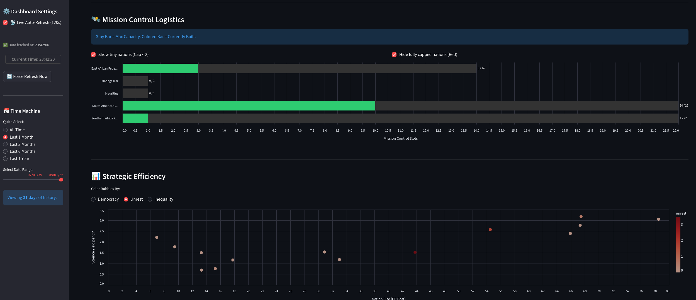
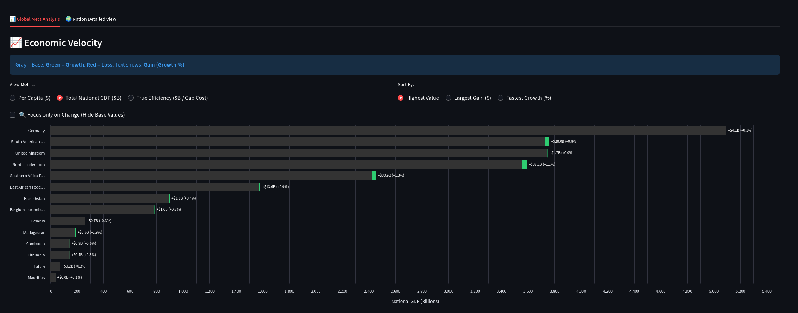
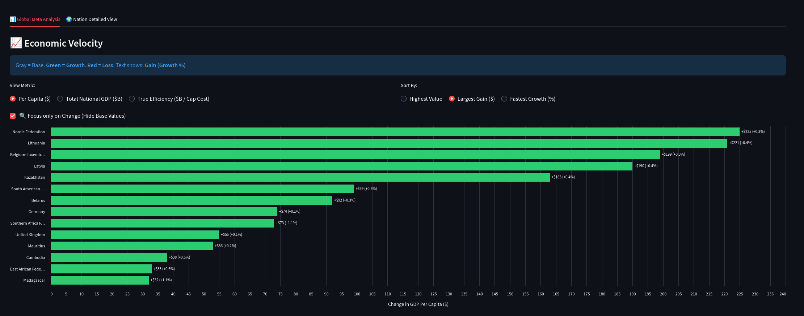
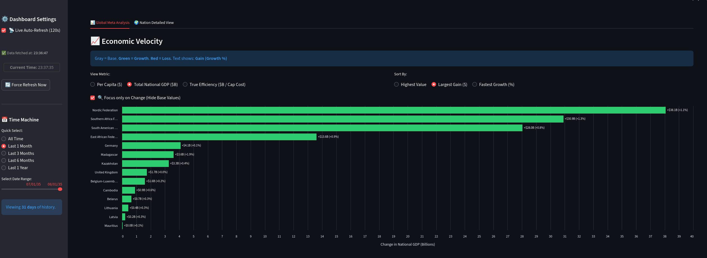
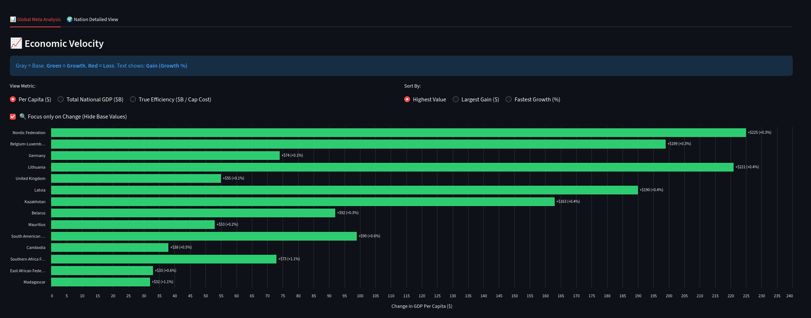

# games-terra-invicta

This repository contains tools to extract and visualize savegame data from the game "Terra Invicta".

Below are screenshots produced by the `show-data.py` Streamlit app. Each image shows a typical view you can generate after running `extraction.py` on a savegame and loading the results into the app.



Mission control logistics overview: a consolidated table and small multiples showing missions assigned to orbital/ground assets, current logistics supply levels, and which missions are under-provisioned. Useful for spotting supply bottlenecks and overloaded mission hubs.



Economic overview (total GDP, highest): bar/line visualisation highlighting the entities with the largest aggregate economies. Handy for quickly identifying the dominant factions or nations in your campaign.



Per-capita economic overview (actual): shows GDP per capita across entities, which surfaces high-performing small states or low-performing large economies. Helps compare living standards rather than raw size.



Total GDP over time: a time-series plot of total GDP for selected entities, useful for tracking economic growth, shocks, or the impact of major events in the campaign.



Per-capita (highest): highlights the top per-capita performers and how they trend over time. Good for spotting rising powers with high productivity per person.

Main scripts
- `extraction.py`: parses Terra Invicta savegames and outputs structured CSV/JSON datasets for analysis.
- `show-data.py`: Streamlit app that loads the extracted datasets and provides interactive charts and filters.

See `requirements.txt` for Python dependencies and the `docs/` folder for additional exported charts and artifacts.

**Getting Started**

Install dependencies and run the extractor (example):

```bash
python3 -m pip install -r requirements.txt
python3 extraction.py
```

Run the Streamlit viewer:

```bash
streamlit run show-data.py
```

Edit `config.yml` and add in the nations you control

```yaml
my_nations:
  - United Kingdom
  - Germany
  - Mauritius
```

# Helpful commands

```bash
cat /home/martin/Games/TerraInvicta/templates/TITechTemplate.json | yq -r '.[] | .techCategory + "|" + .dataName + " - " + (.researchCost|tostring)' | grep -i "spaceScience" | sort -n -k 3

```