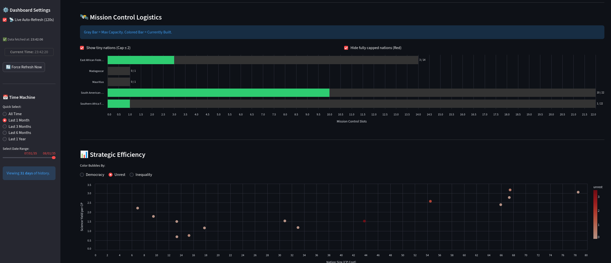
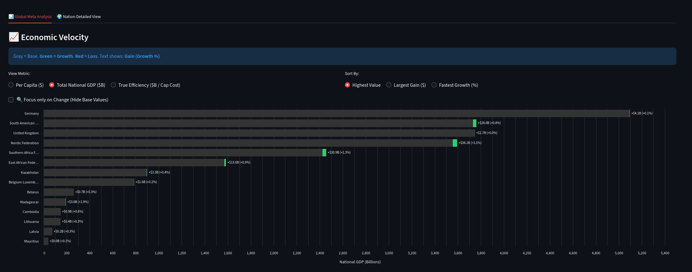
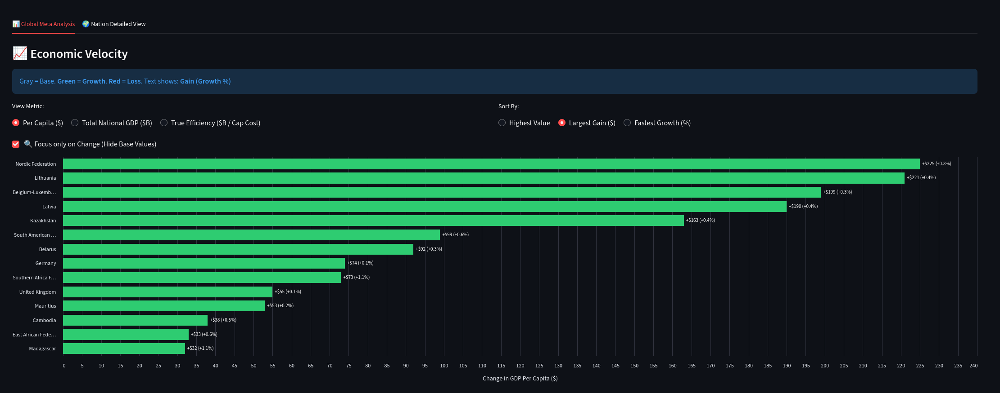
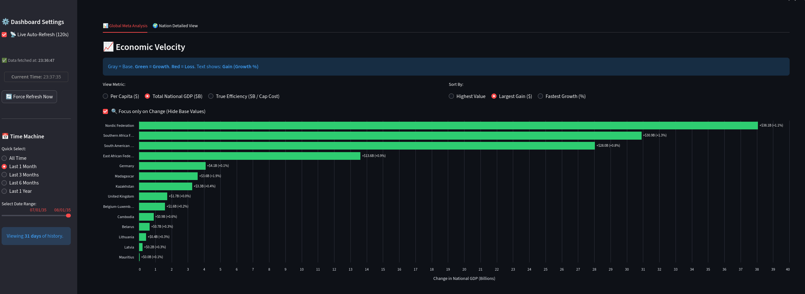
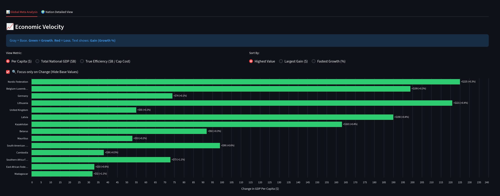

# Overview

**Terra Invicta Progress graph + optional Mod**

This repository contains tools to extract and visualize savegame data from the game "Terra Invicta".

Below are screenshots produced by the `show-data.py` Streamlit app. Each image shows a typical view you can generate after running `extraction.py` on a savegame and loading the results into the app.



Mission control logistics overview: a consolidated table and small multiples showing missions assigned to orbital/ground assets, current logistics supply levels, and which missions are under-provisioned. Useful for spotting supply bottlenecks and overloaded mission hubs.



Economic overview (total GDP, highest): bar/line visualisation highlighting the entities with the largest aggregate economies. Handy for quickly identifying the dominant factions or nations in your campaign.



Per-capita economic overview (actual): shows GDP per capita across entities, which surfaces high-performing small states or low-performing large economies. Helps compare living standards rather than raw size.



Total GDP over time: a time-series plot of total GDP for selected entities, useful for tracking economic growth, shocks, or the impact of major events in the campaign.



Per-capita (highest): highlights the top per-capita performers and how they trend over time. Good for spotting rising powers with high productivity per person.

# Scripts

Three main scripts exists:

- `extraction.py`: parses Terra Invicta savegames and outputs structured CSV/JSON datasets for analysis.
- `show-data.py`: Streamlit app that loads the extracted datasets and provides interactive charts and filters.
- `scripts/cleanup_saves.py`: Script that will archive/delete/tidy up save-games. When save-games > 50 it impacts performance speed of the load/save screen quite a lot.

See `requirements.txt` for Python dependencies and the `docs/` folder for additional exported charts and artifacts.

# Getting Started

**Install dependencies**

```bash
python3 -m pip install -r requirements.txt
```

**Run all scripts via control-script**

To run all 3x scripts, use the control-script for this
```bash
# check script for more options
./runme.sh start|stop
```

**Run scripts individually**

Run the extraction script:

```bash
python3 extraction.py
```

Run the Streamlit viewer:

```bash
streamlit run show-data.py
```

# Add nations the script will capture economic data for

## Automatic way

In the `extraction.py` script, ensure these configs are set to true:

```bash
AUTO_PERSIST_MY_NATIONS = True
ALWAYS_OVERWRITE_MY_NATIONS = True
```

The script will auto-detect which nations a player owns and update the yaml file.

## Manual way

Ensure the above configs are `False` - then add in Nation names manually in the  `config.yml`

Example:

```yaml
my_nations:
  - United Kingdom
  - Germany
  - Mauritius
```

# Helpful commands

```bash
cat /home/martin/Games/TerraInvicta/templates/TITechTemplate.json | yq -r '.[] | .techCategory + "|" + .dataName + " - " + (.researchCost|tostring)' | grep -i "spaceScience" | sort -n -k 3

```

# Generate AI LLM projects + descriptions

Check README.md in the ai-worker folder

Run with model + temperature of choosing; example

```bash
python3 scripts/ai_worker.py --once --print-output --generate-localization --model gemma3:12b --temperature 0.15 --loc-attempts 6 --auto-apply
```


## Temperature determine how random/creative it is.

| Temperature | Expected outcome                                             |
| ----------- | ------------------------------------------------------------ |
| 0.0         | near-greedy/deterministic (very consistent, low creativity). |
| 0.1 - 0.3   | conservative (safe, small variation).                        |
| 0.4 - 0.7   | moderate creativity (more variety).                          |
| ~1.0+       | high randomness (unpredictable).                             |

## LLM Models

### Best models

Generally 12B+ works best for this, lower than 7B produces non-cohesive garbage.

### Find local models using

```bash
ollama list
```

# Calculations for game data

## Power usage for drives:

**Formula:**
```
Required_GW = (Thrust_N × EV_kps) / 2,000 × Efficiency
```

**Example Calculation:**

| Input/Step         | Operation           | Value                               |
| ------------------ | ------------------- | ----------------------------------- |
| Thrust             |                     | 58,752 N                            |
| Exhaust Velocity   |                     | 672 km/s                            |
| Efficiency         |                     | 0.994                               |
| **Step 1**         | Thrust × EV         | 58,752 × 672 = **39,481,344**       |
| **Step 2**         | Result ÷ 2,000      | 39,481,344 ÷ 2,000 = **19,740.672** |
| **Step 3**         | Result × Efficiency | 19,740.672 × 0.994 = **19,622.23**  |
| **Required Power** |                     | **19,622.23 GW**                    |


