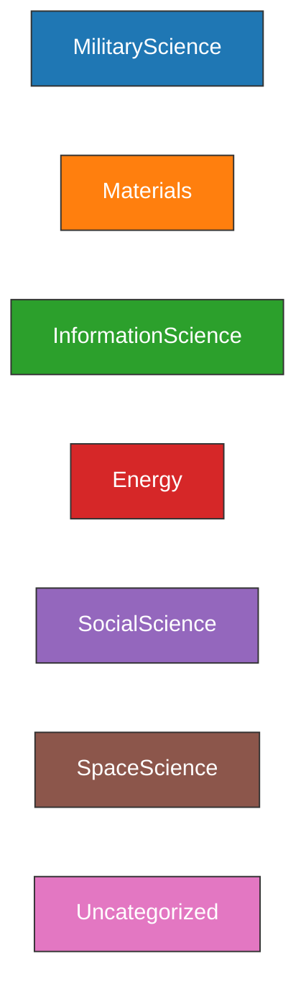

# Projects Outline

This document is generated by `docs/generate_projects_outline.py`.

## Categories & Colors



## Dependency Map

```mermaid
graph LR
Project_25mmAutocannon["25mm Light Rapid Autocannon
(cost: 500)"]
Project_155mmAutocannon_ETC["155mm Heavy ETC Autocannon
(cost: 500)"]
Project_18mmMinigun_ETC["18mm Rapid ETC Minigun
(cost: 500)"]
Project_MicroMissileBayMRK1["Micro Missile Bay MRK1
(cost: 500)"]
Project_ZethrokWaterBonus_L1["Zethrok Water Optimization - Level I
(cost: 500)"]
Project_ZethrokWaterBonus_L2["Zethrok Water Optimization - Level II
(cost: 1000)"]
Project_ZethrokWaterBonus_L3["Zethrok Water Optimization - Level III
(cost: 2000)"]
Project_ZethrokWaterBonus_L4["Zethrok Water Optimization - Level IV
(cost: 5000)"]
Project_ZethrokWaterBonus_L5["Zethrok Water Optimization - Level V
(cost: 10000)"]
Project_ZethrokWaterBonus_L6["Zethrok Water Optimization - Level VI
(cost: 20000)"]
Project_ZethrokVolatilesBonus_L1["Heuristic Volatile Optimization - Level I
(cost: 500)"]
Project_ZethrokVolatilesBonus_L2["Heuristic Volatile Optimization - Level II
(cost: 1000)"]
Project_ZethrokVolatilesBonus_L3["Heuristic Volatile Optimization - Level III
(cost: 2000)"]
Project_ZethrokVolatilesBonus_L4["Heuristic Volatile Optimization - Level IV
(cost: 5000)"]
Project_ZethrokVolatilesBonus_L5["Heuristic Volatile Optimization - Level V
(cost: 10000)"]
Project_ZethrokVolatilesBonus_L6["Heuristic Volatile Optimization - Level VI
(cost: 20000)"]
Project_ZethrokMetalsBonus_L1["Heuristic Metals Optimization - Level I
(cost: 500)"]
Project_ZethrokMetalsBonus_L2["Heuristic Metals Optimization - Level II
(cost: 1000)"]
Project_ZethrokMetalsBonus_L3["Heuristic Metals Optimization - Level III
(cost: 2000)"]
Project_ZethrokMetalsBonus_L4["Heuristic Metals Optimization - Level IV
(cost: 5000)"]
Project_ZethrokMetalsBonus_L5["Heuristic Metals Optimization - Level V
(cost: 10000)"]
Project_ZethrokMetalsBonus_L6["Heuristic Metals Optimization - Level VI
(cost: 20000)"]
Project_ZethrokNobleMetalsBonus_L1["Heuristic Noble Metals Optimization - Level I
(cost: 500)"]
Project_ZethrokNobleMetalsBonus_L2["Heuristic Noble Metals Optimization - Level II
(cost: 1000)"]
Project_ZethrokNobleMetalsBonus_L3["Heuristic Noble Metals Optimization - Level III
(cost: 2000)"]
Project_ZethrokNobleMetalsBonus_L4["Heuristic Noble Metals Optimization - Level IV
(cost: 5000)"]
Project_ZethrokNobleMetalsBonus_L5["Heuristic Noble Metals Optimization - Level V
(cost: 10000)"]
Project_ZethrokNobleMetalsBonus_L6["Heuristic Noble Metals Optimization - Level VI
(cost: 20000)"]
Project_ZethrokFissilesBonus_L1["Heuristic Fissile Optimization - Level I
(cost: 500)"]
Project_ZethrokFissilesBonus_L2["Heuristic Fissile Optimization - Level II
(cost: 1000)"]
Project_ZethrokFissilesBonus_L3["Heuristic Fissile Optimization - Level III
(cost: 2000)"]
Project_ZethrokFissilesBonus_L4["Heuristic Fissile Optimization - Level IV
(cost: 5000)"]
Project_ZethrokFissilesBonus_L5["Heuristic Fissile Optimization - Level V
(cost: 10000)"]
Project_ZethrokFissilesBonus_L6["Heuristic Fissile Optimization - Level VI
(cost: 20000)"]
Project_ZethrokHidingInPlainSight_Beginner["Hiding in Plain Sight - Beginner
(cost: 500)"]
Project_ZethrokHidingInPlainSight_Intermediate["Hiding in Plain Sight - Intermediate
(cost: 2500)"]
Project_ZethrokHidingInPlainSight_Advanced["Hiding in Plain Sight - Advanced
(cost: 5000)"]
Project_ZethrokHidingInPlainSight_Expert["Hiding in Plain Sight - Expert
(cost: 10000)"]
Project_ZethrokHidingInPlainSight_Master["Hiding in Plain Sight - Master
(cost: 35000)"]
Project_PointDefenseArray_T0["Point Defense Array - Tier 0
(cost: 100)"]
Project_ShipMagDamage_lvl1["Nano Optimized Shell Designing
(cost: 5000)"]
Project_ShipMagDamage_lvl2["Argon Hybrid Slug Technology
(cost: 10000)"]
Project_ShipMagDamage_lvl3["Quantum Destabilized Mass Drivers
(cost: 20000)"]
Project_ShipMagDamage_lvl4["Quantum Destabilized Mass Drivers Advanced
(cost: 30000)"]
Project_ThermalFissionFreighters["Thermal Fission Freighters
(cost: 750)"]
Project_EarthTransferOptimization["Earth Transfer Optimization
(cost: 5000)"]
Project_SuperHeatedGravitonDrives["Super Heated Graviton Drives
(cost: 22500)"]
Project_FlyingVehicles["Flying Vehicles
(cost: 8000)"]
Project_AIControlledFlyingVehicles["AI Controlled Flying Vehicles
(cost: 8000)"]
Project_VirtualTouristGuides["Virtual Tourist Guides
(cost: 1500)"]
Project_SpaceInfusedAugmentedRealityTours["Space Infused Augmented Reality Tours
(cost: 1250)"]
Project_RegionalCommandStructure["Regional Command Structure
(cost: 700)"]
Project_AugementedOrganizationalStructures["Augemented Organizational Structures
(cost: 2500)"]
Project_OutpostMiningRefiningModule["Mining - Refining Module Small (TMP)
(cost: 1000)"]
Project_MiningRefiningModule_lvl1["Mining - Refining Module Small
(cost: 1000)"]
Project_MiningRefiningModule_lvl2["Mining - Refining Module Medium
(cost: 7500)"]
Project_MiningRefiningModule_lvl3["Mining - Refining Module Large
(cost: 15000)"]
Project_BronzeRush["Bronze Rush
(cost: 500)"]
Project_SilverRush["Silver Rush
(cost: 1250)"]
Project_DiamondRush["Diamond Rush
(cost: 5000)"]
Project_PointDefenseArray["Project_PointDefenseArray
(cost: None)"]
Project_Warships["Project_Warships
(cost: None)"]
Project_25mmAutocannon --> Project_Warships
PrinciplesofSpaceWarfare["PrinciplesofSpaceWarfare"]
Project_25mmAutocannon --> PrinciplesofSpaceWarfare
Project_155mmAutocannon_ETC --> Project_Warships
PrinciplesofSpaceWarfare["PrinciplesofSpaceWarfare"]
Project_155mmAutocannon_ETC --> PrinciplesofSpaceWarfare
Project_18mmMinigun_ETC --> Project_Warships
PrinciplesofSpaceWarfare["PrinciplesofSpaceWarfare"]
Project_18mmMinigun_ETC --> PrinciplesofSpaceWarfare
Project_MicroMissileBayMRK1 --> Project_Warships
PrinciplesofSpaceWarfare["PrinciplesofSpaceWarfare"]
Project_MicroMissileBayMRK1 --> PrinciplesofSpaceWarfare
MissiontotheMoon["MissiontotheMoon"]
Project_ZethrokWaterBonus_L1 --> MissiontotheMoon
SpaceMiningandRefining["SpaceMiningandRefining"]
Project_ZethrokWaterBonus_L2 --> SpaceMiningandRefining
MissiontoMars["MissiontoMars"]
Project_ZethrokWaterBonus_L3 --> MissiontoMars
MissiontotheAsteroids["MissiontotheAsteroids"]
Project_ZethrokWaterBonus_L3 --> MissiontotheAsteroids
MissiontoVenus["MissiontoVenus"]
Project_ZethrokWaterBonus_L3 --> MissiontoVenus
SettlementHabs["SettlementHabs"]
Project_ZethrokWaterBonus_L4 --> SettlementHabs
MissiontotheInnerPlanets["MissiontotheInnerPlanets"]
Project_ZethrokWaterBonus_L4 --> MissiontotheInnerPlanets
MissiontoSaturn["MissiontoSaturn"]
Project_ZethrokWaterBonus_L5 --> MissiontoSaturn
IndustrializationofSpace["IndustrializationofSpace"]
Project_ZethrokWaterBonus_L5 --> IndustrializationofSpace
MissiontoSaturn["MissiontoSaturn"]
Project_ZethrokWaterBonus_L6 --> MissiontoSaturn
AdvancedAtomicManipulation["AdvancedAtomicManipulation"]
Project_ZethrokWaterBonus_L6 --> AdvancedAtomicManipulation
MissiontotheMoon["MissiontotheMoon"]
Project_ZethrokVolatilesBonus_L1 --> MissiontotheMoon
SpaceMiningandRefining["SpaceMiningandRefining"]
Project_ZethrokVolatilesBonus_L2 --> SpaceMiningandRefining
MissiontoMars["MissiontoMars"]
Project_ZethrokVolatilesBonus_L3 --> MissiontoMars
MissiontotheAsteroids["MissiontotheAsteroids"]
Project_ZethrokVolatilesBonus_L3 --> MissiontotheAsteroids
MissiontoVenus["MissiontoVenus"]
Project_ZethrokVolatilesBonus_L3 --> MissiontoVenus
SettlementHabs["SettlementHabs"]
Project_ZethrokVolatilesBonus_L4 --> SettlementHabs
MissiontotheInnerPlanets["MissiontotheInnerPlanets"]
Project_ZethrokVolatilesBonus_L4 --> MissiontotheInnerPlanets
MissiontoSaturn["MissiontoSaturn"]
Project_ZethrokVolatilesBonus_L5 --> MissiontoSaturn
IndustrializationofSpace["IndustrializationofSpace"]
Project_ZethrokVolatilesBonus_L5 --> IndustrializationofSpace
MissiontoSaturn["MissiontoSaturn"]
Project_ZethrokVolatilesBonus_L6 --> MissiontoSaturn
AdvancedAtomicManipulation["AdvancedAtomicManipulation"]
Project_ZethrokVolatilesBonus_L6 --> AdvancedAtomicManipulation
MissiontotheMoon["MissiontotheMoon"]
Project_ZethrokMetalsBonus_L1 --> MissiontotheMoon
SpaceMiningandRefining["SpaceMiningandRefining"]
Project_ZethrokMetalsBonus_L2 --> SpaceMiningandRefining
MissiontoMars["MissiontoMars"]
Project_ZethrokMetalsBonus_L3 --> MissiontoMars
MissiontotheAsteroids["MissiontotheAsteroids"]
Project_ZethrokMetalsBonus_L3 --> MissiontotheAsteroids
MissiontoVenus["MissiontoVenus"]
Project_ZethrokMetalsBonus_L3 --> MissiontoVenus
SettlementHabs["SettlementHabs"]
Project_ZethrokMetalsBonus_L4 --> SettlementHabs
MissiontotheInnerPlanets["MissiontotheInnerPlanets"]
Project_ZethrokMetalsBonus_L4 --> MissiontotheInnerPlanets
MissiontoSaturn["MissiontoSaturn"]
Project_ZethrokMetalsBonus_L5 --> MissiontoSaturn
IndustrializationofSpace["IndustrializationofSpace"]
Project_ZethrokMetalsBonus_L5 --> IndustrializationofSpace
MissiontoSaturn["MissiontoSaturn"]
Project_ZethrokMetalsBonus_L6 --> MissiontoSaturn
AdvancedAtomicManipulation["AdvancedAtomicManipulation"]
Project_ZethrokMetalsBonus_L6 --> AdvancedAtomicManipulation
MissiontotheMoon["MissiontotheMoon"]
Project_ZethrokNobleMetalsBonus_L1 --> MissiontotheMoon
SpaceMiningandRefining["SpaceMiningandRefining"]
Project_ZethrokNobleMetalsBonus_L2 --> SpaceMiningandRefining
MissiontoMars["MissiontoMars"]
Project_ZethrokNobleMetalsBonus_L3 --> MissiontoMars
MissiontotheAsteroids["MissiontotheAsteroids"]
Project_ZethrokNobleMetalsBonus_L3 --> MissiontotheAsteroids
MissiontoVenus["MissiontoVenus"]
Project_ZethrokNobleMetalsBonus_L3 --> MissiontoVenus
SettlementHabs["SettlementHabs"]
Project_ZethrokNobleMetalsBonus_L4 --> SettlementHabs
MissiontotheInnerPlanets["MissiontotheInnerPlanets"]
Project_ZethrokNobleMetalsBonus_L4 --> MissiontotheInnerPlanets
MissiontoSaturn["MissiontoSaturn"]
Project_ZethrokNobleMetalsBonus_L5 --> MissiontoSaturn
IndustrializationofSpace["IndustrializationofSpace"]
Project_ZethrokNobleMetalsBonus_L5 --> IndustrializationofSpace
MissiontoSaturn["MissiontoSaturn"]
Project_ZethrokNobleMetalsBonus_L6 --> MissiontoSaturn
AdvancedAtomicManipulation["AdvancedAtomicManipulation"]
Project_ZethrokNobleMetalsBonus_L6 --> AdvancedAtomicManipulation
MissiontotheMoon["MissiontotheMoon"]
Project_ZethrokFissilesBonus_L1 --> MissiontotheMoon
SpaceMiningandRefining["SpaceMiningandRefining"]
Project_ZethrokFissilesBonus_L2 --> SpaceMiningandRefining
MissiontoMars["MissiontoMars"]
Project_ZethrokFissilesBonus_L3 --> MissiontoMars
MissiontotheAsteroids["MissiontotheAsteroids"]
Project_ZethrokFissilesBonus_L3 --> MissiontotheAsteroids
MissiontoVenus["MissiontoVenus"]
Project_ZethrokFissilesBonus_L3 --> MissiontoVenus
SettlementHabs["SettlementHabs"]
Project_ZethrokFissilesBonus_L4 --> SettlementHabs
MissiontotheInnerPlanets["MissiontotheInnerPlanets"]
Project_ZethrokFissilesBonus_L4 --> MissiontotheInnerPlanets
MissiontoSaturn["MissiontoSaturn"]
Project_ZethrokFissilesBonus_L5 --> MissiontoSaturn
IndustrializationofSpace["IndustrializationofSpace"]
Project_ZethrokFissilesBonus_L5 --> IndustrializationofSpace
MissiontoSaturn["MissiontoSaturn"]
Project_ZethrokFissilesBonus_L6 --> MissiontoSaturn
AdvancedAtomicManipulation["AdvancedAtomicManipulation"]
Project_ZethrokFissilesBonus_L6 --> AdvancedAtomicManipulation
WeAreNotAlone["WeAreNotAlone"]
Project_ZethrokHidingInPlainSight_Beginner --> WeAreNotAlone
ArrivalSociology["ArrivalSociology"]
Project_ZethrokHidingInPlainSight_Intermediate --> ArrivalSociology
ArrivalInternationalRelations["ArrivalInternationalRelations"]
Project_ZethrokHidingInPlainSight_Advanced --> ArrivalInternationalRelations
FallofEmpires["FallofEmpires"]
Project_ZethrokHidingInPlainSight_Expert --> FallofEmpires
ArrivalGovernance["ArrivalGovernance"]
Project_ZethrokHidingInPlainSight_Master --> ArrivalGovernance
Project_PlatformCore["Project_PlatformCore"]
Project_PointDefenseArray_T0 --> Project_PlatformCore
Railguns["Railguns"]
Project_ShipMagDamage_lvl1 --> Railguns
Railguns["Railguns"]
Project_ShipMagDamage_lvl2 --> Railguns
Superalloys["Superalloys"]
Project_ShipMagDamage_lvl2 --> Superalloys
Railguns["Railguns"]
Project_ShipMagDamage_lvl3 --> Railguns
SuperconductingMagnets["SuperconductingMagnets"]
Project_ShipMagDamage_lvl3 --> SuperconductingMagnets
Railguns["Railguns"]
Project_ShipMagDamage_lvl4 --> Railguns
Coilguns["Coilguns"]
Project_ShipMagDamage_lvl4 --> Coilguns
ElectrothermalPropulsion["ElectrothermalPropulsion"]
Project_ThermalFissionFreighters --> ElectrothermalPropulsion
ElectrostaticPropulsion["ElectrostaticPropulsion"]
Project_EarthTransferOptimization --> ElectrostaticPropulsion
Neutronics["Neutronics"]
Project_SuperHeatedGravitonDrives --> Neutronics
AdvancedNeuralNetworks["AdvancedNeuralNetworks"]
Project_FlyingVehicles --> AdvancedNeuralNetworks
SelfRepairingSoftware["SelfRepairingSoftware"]
Project_AIControlledFlyingVehicles --> SelfRepairingSoftware
SpaceTourism["SpaceTourism"]
Project_VirtualTouristGuides --> SpaceTourism
DeepSystemSkywatch["DeepSystemSkywatch"]
Project_SpaceInfusedAugmentedRealityTours --> DeepSystemSkywatch
DeepSystemSkywatch["DeepSystemSkywatch"]
Project_RegionalCommandStructure --> DeepSystemSkywatch
ArrivalSociology["ArrivalSociology"]
Project_AugementedOrganizationalStructures --> ArrivalSociology
Project_NeutronFluxTorch["Project_NeutronFluxTorch"]
Project_OutpostMiningRefiningModule --> Project_NeutronFluxTorch
Project_OutpostMiningComplex["Project_OutpostMiningComplex"]
Project_MiningRefiningModule_lvl1 --> Project_OutpostMiningComplex
Project_SettlementMiningComplex["Project_SettlementMiningComplex"]
Project_MiningRefiningModule_lvl2 --> Project_SettlementMiningComplex
Project_ColonyMiningComplex["Project_ColonyMiningComplex"]
Project_MiningRefiningModule_lvl3 --> Project_ColonyMiningComplex
Project_OutpostMiningComplex["Project_OutpostMiningComplex"]
Project_BronzeRush --> Project_OutpostMiningComplex
Project_OutpostMiningComplex["Project_OutpostMiningComplex"]
Project_SilverRush --> Project_OutpostMiningComplex
SpaceMiningandRefining["SpaceMiningandRefining"]
Project_SilverRush --> SpaceMiningandRefining
Project_ColonyMiningComplex["Project_ColonyMiningComplex"]
Project_DiamondRush --> Project_ColonyMiningComplex
Mod_TIGunTemplate["TIGunTemplate.json"]
Mod_TIGunTemplate --> Project_25mmAutocannon
Mod_TIGunTemplate["TIGunTemplate.json"]
Mod_TIGunTemplate --> Project_155mmAutocannon_ETC
Mod_TIGunTemplate["TIGunTemplate.json"]
Mod_TIGunTemplate --> Project_18mmMinigun_ETC
Mod_TIMissileTemplate["TIMissileTemplate.json"]
Mod_TIMissileTemplate --> Project_MicroMissileBayMRK1
Mod_TIHabModuleTemplate["TIHabModuleTemplate.json"]
Mod_TIHabModuleTemplate --> Project_PointDefenseArray_T0
Mod_TIHabModuleTemplate["TIHabModuleTemplate.json"]
Mod_TIHabModuleTemplate --> Project_OutpostMiningRefiningModule
Mod_TIHabModuleTemplate["TIHabModuleTemplate.json"]
Mod_TIHabModuleTemplate --> Project_MiningRefiningModule_lvl1
Mod_TIHabModuleTemplate["TIHabModuleTemplate.json"]
Mod_TIHabModuleTemplate --> Project_MiningRefiningModule_lvl2
Mod_TIHabModuleTemplate["TIHabModuleTemplate.json"]
Mod_TIHabModuleTemplate --> Project_MiningRefiningModule_lvl3
Mod_TIHabModuleTemplate["TIHabModuleTemplate.json"]
Mod_TIHabModuleTemplate --> Project_PointDefenseArray
Mod_TIShipHullTemplate["TIShipHullTemplate.json"]
Mod_TIShipHullTemplate --> Project_Warships
classDef cat_MilitaryScience fill:#1f77b4,stroke:#333,color:#fff;
classDef cat_Materials fill:#ff7f0e,stroke:#333,color:#fff;
classDef cat_InformationScience fill:#2ca02c,stroke:#333,color:#fff;
classDef cat_Energy fill:#d62728,stroke:#333,color:#fff;
classDef cat_SocialScience fill:#9467bd,stroke:#333,color:#fff;
classDef cat_SpaceScience fill:#8c564b,stroke:#333,color:#fff;
classDef cat_Uncategorized fill:#e377c2,stroke:#333,color:#fff;
class Project_25mmAutocannon cat_MilitaryScience;
class Project_155mmAutocannon_ETC cat_MilitaryScience;
class Project_18mmMinigun_ETC cat_MilitaryScience;
class Project_MicroMissileBayMRK1 cat_MilitaryScience;
class Project_ZethrokWaterBonus_L1 cat_Materials;
class Project_ZethrokWaterBonus_L2 cat_Materials;
class Project_ZethrokWaterBonus_L3 cat_Materials;
class Project_ZethrokWaterBonus_L4 cat_Materials;
class Project_ZethrokWaterBonus_L5 cat_Materials;
class Project_ZethrokWaterBonus_L6 cat_Materials;
class Project_ZethrokVolatilesBonus_L1 cat_Materials;
class Project_ZethrokVolatilesBonus_L2 cat_Materials;
class Project_ZethrokVolatilesBonus_L3 cat_Materials;
class Project_ZethrokVolatilesBonus_L4 cat_Materials;
class Project_ZethrokVolatilesBonus_L5 cat_Materials;
class Project_ZethrokVolatilesBonus_L6 cat_Materials;
class Project_ZethrokMetalsBonus_L1 cat_Materials;
class Project_ZethrokMetalsBonus_L2 cat_Materials;
class Project_ZethrokMetalsBonus_L3 cat_Materials;
class Project_ZethrokMetalsBonus_L4 cat_Materials;
class Project_ZethrokMetalsBonus_L5 cat_Materials;
class Project_ZethrokMetalsBonus_L6 cat_Materials;
class Project_ZethrokNobleMetalsBonus_L1 cat_Materials;
class Project_ZethrokNobleMetalsBonus_L2 cat_Materials;
class Project_ZethrokNobleMetalsBonus_L3 cat_Materials;
class Project_ZethrokNobleMetalsBonus_L4 cat_Materials;
class Project_ZethrokNobleMetalsBonus_L5 cat_Materials;
class Project_ZethrokNobleMetalsBonus_L6 cat_Materials;
class Project_ZethrokFissilesBonus_L1 cat_Materials;
class Project_ZethrokFissilesBonus_L2 cat_Materials;
class Project_ZethrokFissilesBonus_L3 cat_Materials;
class Project_ZethrokFissilesBonus_L4 cat_Materials;
class Project_ZethrokFissilesBonus_L5 cat_Materials;
class Project_ZethrokFissilesBonus_L6 cat_Materials;
class Project_ZethrokHidingInPlainSight_Beginner cat_InformationScience;
class Project_ZethrokHidingInPlainSight_Intermediate cat_InformationScience;
class Project_ZethrokHidingInPlainSight_Advanced cat_InformationScience;
class Project_ZethrokHidingInPlainSight_Expert cat_InformationScience;
class Project_ZethrokHidingInPlainSight_Master cat_InformationScience;
class Project_PointDefenseArray_T0 cat_MilitaryScience;
class Project_ShipMagDamage_lvl1 cat_InformationScience;
class Project_ShipMagDamage_lvl2 cat_InformationScience;
class Project_ShipMagDamage_lvl3 cat_InformationScience;
class Project_ShipMagDamage_lvl4 cat_InformationScience;
class Project_ThermalFissionFreighters cat_Energy;
class Project_EarthTransferOptimization cat_Energy;
class Project_SuperHeatedGravitonDrives cat_Energy;
class Project_FlyingVehicles cat_InformationScience;
class Project_AIControlledFlyingVehicles cat_InformationScience;
class Project_VirtualTouristGuides cat_InformationScience;
class Project_SpaceInfusedAugmentedRealityTours cat_InformationScience;
class Project_RegionalCommandStructure cat_SocialScience;
class Project_AugementedOrganizationalStructures cat_SocialScience;
class Project_OutpostMiningRefiningModule cat_SpaceScience;
class Project_MiningRefiningModule_lvl1 cat_SpaceScience;
class Project_MiningRefiningModule_lvl2 cat_SpaceScience;
class Project_MiningRefiningModule_lvl3 cat_SpaceScience;
class Project_BronzeRush cat_Materials;
class Project_SilverRush cat_Materials;
class Project_DiamondRush cat_Materials;
class Project_PointDefenseArray cat_Uncategorized;
class Project_Warships cat_Uncategorized;
```

---

## 25mm Light Rapid Autocannon — Project_25mmAutocannon

- **researchCost**: 500
- **techCategory**: MilitaryScience
- **prereqs**: ["Project_Warships", "PrinciplesofSpaceWarfare"]
- **effects**: {"unlockPart": ["25mmAutocannon_LightRapid"]}
- **referenced by mods**:
  - Mods/TIGunTemplate.json

## 155mm Heavy ETC Autocannon — Project_155mmAutocannon_ETC

- **researchCost**: 500
- **techCategory**: MilitaryScience
- **prereqs**: ["Project_Warships", "PrinciplesofSpaceWarfare"]
- **effects**: []
- **referenced by mods**:
  - Mods/TIGunTemplate.json

## 18mm Rapid ETC Minigun — Project_18mmMinigun_ETC

- **researchCost**: 500
- **techCategory**: MilitaryScience
- **prereqs**: ["Project_Warships", "PrinciplesofSpaceWarfare"]
- **effects**: []
- **referenced by mods**:
  - Mods/TIGunTemplate.json

## Micro Missile Bay MRK1 — Project_MicroMissileBayMRK1

- **researchCost**: 500
- **techCategory**: MilitaryScience
- **prereqs**: ["Project_Warships", "PrinciplesofSpaceWarfare"]
- **effects**: []
- **referenced by mods**:
  - Mods/TIMissileTemplate.json

## Zethrok Water Optimization - Level I — Project_ZethrokWaterBonus_L1

- **researchCost**: 500
- **techCategory**: Materials
- **prereqs**: ["MissiontotheMoon"]
- **effects**: ["Effect_MiningWaterBonus_lvl1"]
- **referenced by mods**: []

## Zethrok Water Optimization - Level II — Project_ZethrokWaterBonus_L2

- **researchCost**: 1000
- **techCategory**: Materials
- **prereqs**: ["SpaceMiningandRefining"]
- **effects**: ["Effect_MiningWaterBonus_lvl2"]
- **referenced by mods**: []

## Zethrok Water Optimization - Level III — Project_ZethrokWaterBonus_L3

- **researchCost**: 2000
- **techCategory**: Materials
- **prereqs**: ["MissiontoMars", "MissiontotheAsteroids", "MissiontoVenus"]
- **effects**: ["Effect_MiningWaterBonus_lvl3"]
- **referenced by mods**: []

## Zethrok Water Optimization - Level IV — Project_ZethrokWaterBonus_L4

- **researchCost**: 5000
- **techCategory**: Materials
- **prereqs**: ["SettlementHabs", "MissiontotheInnerPlanets"]
- **effects**: ["Effect_MiningWaterBonus_lvl4"]
- **referenced by mods**: []

## Zethrok Water Optimization - Level V — Project_ZethrokWaterBonus_L5

- **researchCost**: 10000
- **techCategory**: Materials
- **prereqs**: ["MissiontoSaturn", "IndustrializationofSpace"]
- **effects**: ["Effect_MiningWaterBonus_lvl5"]
- **referenced by mods**: []

## Zethrok Water Optimization - Level VI — Project_ZethrokWaterBonus_L6

- **researchCost**: 20000
- **techCategory**: Materials
- **prereqs**: ["MissiontoSaturn", "AdvancedAtomicManipulation"]
- **effects**: ["Effect_MiningWaterBonus_lvl6"]
- **referenced by mods**: []

## Heuristic Volatile Optimization - Level I — Project_ZethrokVolatilesBonus_L1

- **researchCost**: 500
- **techCategory**: Materials
- **prereqs**: ["MissiontotheMoon"]
- **effects**: ["Effect_MiningVolatilesBonus_lvl1"]
- **referenced by mods**: []

## Heuristic Volatile Optimization - Level II — Project_ZethrokVolatilesBonus_L2

- **researchCost**: 1000
- **techCategory**: Materials
- **prereqs**: ["SpaceMiningandRefining"]
- **effects**: ["Effect_MiningVolatilesBonus_lvl2"]
- **referenced by mods**: []

## Heuristic Volatile Optimization - Level III — Project_ZethrokVolatilesBonus_L3

- **researchCost**: 2000
- **techCategory**: Materials
- **prereqs**: ["MissiontoMars", "MissiontotheAsteroids", "MissiontoVenus"]
- **effects**: ["Effect_MiningVolatilesBonus_lvl3"]
- **referenced by mods**: []

## Heuristic Volatile Optimization - Level IV — Project_ZethrokVolatilesBonus_L4

- **researchCost**: 5000
- **techCategory**: Materials
- **prereqs**: ["SettlementHabs", "MissiontotheInnerPlanets"]
- **effects**: ["Effect_MiningVolatilesBonus_lvl4"]
- **referenced by mods**: []

## Heuristic Volatile Optimization - Level V — Project_ZethrokVolatilesBonus_L5

- **researchCost**: 10000
- **techCategory**: Materials
- **prereqs**: ["MissiontoSaturn", "IndustrializationofSpace"]
- **effects**: ["Effect_MiningVolatilesBonus_lvl5"]
- **referenced by mods**: []

## Heuristic Volatile Optimization - Level VI — Project_ZethrokVolatilesBonus_L6

- **researchCost**: 20000
- **techCategory**: Materials
- **prereqs**: ["MissiontoSaturn", "AdvancedAtomicManipulation"]
- **effects**: ["Effect_MiningVolatilesBonus_lvl6"]
- **referenced by mods**: []

## Heuristic Metals Optimization - Level I — Project_ZethrokMetalsBonus_L1

- **researchCost**: 500
- **techCategory**: Materials
- **prereqs**: ["MissiontotheMoon"]
- **effects**: ["Effect_MiningMetalsBonus_lvl1"]
- **referenced by mods**: []

## Heuristic Metals Optimization - Level II — Project_ZethrokMetalsBonus_L2

- **researchCost**: 1000
- **techCategory**: Materials
- **prereqs**: ["SpaceMiningandRefining"]
- **effects**: ["Effect_MiningMetalsBonus_lvl2"]
- **referenced by mods**: []

## Heuristic Metals Optimization - Level III — Project_ZethrokMetalsBonus_L3

- **researchCost**: 2000
- **techCategory**: Materials
- **prereqs**: ["MissiontoMars", "MissiontotheAsteroids", "MissiontoVenus"]
- **effects**: ["Effect_MiningMetalsBonus_lvl3"]
- **referenced by mods**: []

## Heuristic Metals Optimization - Level IV — Project_ZethrokMetalsBonus_L4

- **researchCost**: 5000
- **techCategory**: Materials
- **prereqs**: ["SettlementHabs", "MissiontotheInnerPlanets"]
- **effects**: ["Effect_MiningMetalsBonus_lvl4"]
- **referenced by mods**: []

## Heuristic Metals Optimization - Level V — Project_ZethrokMetalsBonus_L5

- **researchCost**: 10000
- **techCategory**: Materials
- **prereqs**: ["MissiontoSaturn", "IndustrializationofSpace"]
- **effects**: ["Effect_MiningMetalsBonus_lvl5"]
- **referenced by mods**: []

## Heuristic Metals Optimization - Level VI — Project_ZethrokMetalsBonus_L6

- **researchCost**: 20000
- **techCategory**: Materials
- **prereqs**: ["MissiontoSaturn", "AdvancedAtomicManipulation"]
- **effects**: ["Effect_MiningMetalsBonus_lvl6"]
- **referenced by mods**: []

## Heuristic Noble Metals Optimization - Level I — Project_ZethrokNobleMetalsBonus_L1

- **researchCost**: 500
- **techCategory**: Materials
- **prereqs**: ["MissiontotheMoon"]
- **effects**: ["Effect_MiningNobleMetalsBonus_lvl1"]
- **referenced by mods**: []

## Heuristic Noble Metals Optimization - Level II — Project_ZethrokNobleMetalsBonus_L2

- **researchCost**: 1000
- **techCategory**: Materials
- **prereqs**: ["SpaceMiningandRefining"]
- **effects**: ["Effect_MiningNobleMetalsBonus_lvl2"]
- **referenced by mods**: []

## Heuristic Noble Metals Optimization - Level III — Project_ZethrokNobleMetalsBonus_L3

- **researchCost**: 2000
- **techCategory**: Materials
- **prereqs**: ["MissiontoMars", "MissiontotheAsteroids", "MissiontoVenus"]
- **effects**: ["Effect_MiningNobleMetalsBonus_lvl3"]
- **referenced by mods**: []

## Heuristic Noble Metals Optimization - Level IV — Project_ZethrokNobleMetalsBonus_L4

- **researchCost**: 5000
- **techCategory**: Materials
- **prereqs**: ["SettlementHabs", "MissiontotheInnerPlanets"]
- **effects**: ["Effect_MiningNobleMetalsBonus_lvl4"]
- **referenced by mods**: []

## Heuristic Noble Metals Optimization - Level V — Project_ZethrokNobleMetalsBonus_L5

- **researchCost**: 10000
- **techCategory**: Materials
- **prereqs**: ["MissiontoSaturn", "IndustrializationofSpace"]
- **effects**: ["Effect_MiningNobleMetalsBonus_lvl5"]
- **referenced by mods**: []

## Heuristic Noble Metals Optimization - Level VI — Project_ZethrokNobleMetalsBonus_L6

- **researchCost**: 20000
- **techCategory**: Materials
- **prereqs**: ["MissiontoSaturn", "AdvancedAtomicManipulation"]
- **effects**: ["Effect_MiningNobleMetalsBonus_lvl6"]
- **referenced by mods**: []

## Heuristic Fissile Optimization - Level I — Project_ZethrokFissilesBonus_L1

- **researchCost**: 500
- **techCategory**: Materials
- **prereqs**: ["MissiontotheMoon"]
- **effects**: ["Effect_MiningFissilesBonus_lvl1"]
- **referenced by mods**: []

## Heuristic Fissile Optimization - Level II — Project_ZethrokFissilesBonus_L2

- **researchCost**: 1000
- **techCategory**: Materials
- **prereqs**: ["SpaceMiningandRefining"]
- **effects**: ["Effect_MiningFissilesBonus_lvl2"]
- **referenced by mods**: []

## Heuristic Fissile Optimization - Level III — Project_ZethrokFissilesBonus_L3

- **researchCost**: 2000
- **techCategory**: Materials
- **prereqs**: ["MissiontoMars", "MissiontotheAsteroids", "MissiontoVenus"]
- **effects**: ["Effect_MiningFissilesBonus_lvl3"]
- **referenced by mods**: []

## Heuristic Fissile Optimization - Level IV — Project_ZethrokFissilesBonus_L4

- **researchCost**: 5000
- **techCategory**: Materials
- **prereqs**: ["SettlementHabs", "MissiontotheInnerPlanets"]
- **effects**: ["Effect_MiningFissilesBonus_lvl4"]
- **referenced by mods**: []

## Heuristic Fissile Optimization - Level V — Project_ZethrokFissilesBonus_L5

- **researchCost**: 10000
- **techCategory**: Materials
- **prereqs**: ["MissiontoSaturn", "IndustrializationofSpace"]
- **effects**: ["Effect_MiningFissilesBonus_lvl5"]
- **referenced by mods**: []

## Heuristic Fissile Optimization - Level VI — Project_ZethrokFissilesBonus_L6

- **researchCost**: 20000
- **techCategory**: Materials
- **prereqs**: ["MissiontoSaturn", "AdvancedAtomicManipulation"]
- **effects**: ["Effect_MiningFissilesBonus_lvl6"]
- **referenced by mods**: []

## Hiding in Plain Sight - Beginner — Project_ZethrokHidingInPlainSight_Beginner

- **researchCost**: 500
- **techCategory**: InformationScience
- **prereqs**: ["WeAreNotAlone"]
- **effects**: ["Effect_MCUsageMasking_Beginner"]
- **referenced by mods**: []

## Hiding in Plain Sight - Intermediate — Project_ZethrokHidingInPlainSight_Intermediate

- **researchCost**: 2500
- **techCategory**: InformationScience
- **prereqs**: ["ArrivalSociology"]
- **effects**: ["Effect_MCUsageMasking_Intermediate"]
- **referenced by mods**: []

## Hiding in Plain Sight - Advanced — Project_ZethrokHidingInPlainSight_Advanced

- **researchCost**: 5000
- **techCategory**: InformationScience
- **prereqs**: ["ArrivalInternationalRelations"]
- **effects**: ["Effect_MCUsageMasking_Advanced"]
- **referenced by mods**: []

## Hiding in Plain Sight - Expert — Project_ZethrokHidingInPlainSight_Expert

- **researchCost**: 10000
- **techCategory**: InformationScience
- **prereqs**: ["FallofEmpires"]
- **effects**: ["Effect_MCUsageMasking_Expert"]
- **referenced by mods**: []

## Hiding in Plain Sight - Master — Project_ZethrokHidingInPlainSight_Master

- **researchCost**: 35000
- **techCategory**: InformationScience
- **prereqs**: ["ArrivalGovernance"]
- **effects**: ["Effect_MCUsageMasking_Master"]
- **referenced by mods**: []

## Point Defense Array - Tier 0 — Project_PointDefenseArray_T0

- **researchCost**: 100
- **techCategory**: MilitaryScience
- **prereqs**: ["Project_PlatformCore"]
- **effects**: []
- **referenced by mods**:
  - Mods/TIHabModuleTemplate.json

## Nano Optimized Shell Designing — Project_ShipMagDamage_lvl1

- **researchCost**: 5000
- **techCategory**: InformationScience
- **prereqs**: ["Railguns"]
- **effects**: ["Effect_ShipMagDamage"]
- **referenced by mods**: []

## Argon Hybrid Slug Technology — Project_ShipMagDamage_lvl2

- **researchCost**: 10000
- **techCategory**: InformationScience
- **prereqs**: ["Railguns", "Superalloys"]
- **effects**: ["Effect_ShipMagDamage"]
- **referenced by mods**: []

## Quantum Destabilized Mass Drivers — Project_ShipMagDamage_lvl3

- **researchCost**: 20000
- **techCategory**: InformationScience
- **prereqs**: ["Railguns", "SuperconductingMagnets"]
- **effects**: ["Effect_ShipMagDamage"]
- **referenced by mods**: []

## Quantum Destabilized Mass Drivers Advanced — Project_ShipMagDamage_lvl4

- **researchCost**: 30000
- **techCategory**: InformationScience
- **prereqs**: ["Railguns", "Coilguns"]
- **effects**: ["Effect_ShipMagDamage"]
- **referenced by mods**: []

## Thermal Fission Freighters — Project_ThermalFissionFreighters

- **researchCost**: 750
- **techCategory**: Energy
- **prereqs**: ["ElectrothermalPropulsion"]
- **effects**: ["Effect_ThermalFissionFreighters", "Effect_ThermalFissionRockets"]
- **referenced by mods**: []

## Earth Transfer Optimization — Project_EarthTransferOptimization

- **researchCost**: 5000
- **techCategory**: Energy
- **prereqs**: ["ElectrostaticPropulsion"]
- **effects**: ["Effect_StarLightFreighters", "Effect_StarLightRockets"]
- **referenced by mods**: []

## Super Heated Graviton Drives — Project_SuperHeatedGravitonDrives

- **researchCost**: 22500
- **techCategory**: Energy
- **prereqs**: ["Neutronics"]
- **effects**: ["Effect_GravitonFreighters", "Effect_GravitonRockets"]
- **referenced by mods**: []

## Flying Vehicles — Project_FlyingVehicles

- **researchCost**: 8000
- **techCategory**: InformationScience
- **prereqs**: ["AdvancedNeuralNetworks"]
- **effects**: ["Effect_EconomyPriorityBonus05"]
- **referenced by mods**: []

## AI Controlled Flying Vehicles — Project_AIControlledFlyingVehicles

- **researchCost**: 8000
- **techCategory**: InformationScience
- **prereqs**: ["SelfRepairingSoftware"]
- **effects**: ["Effect_EconomyPriorityBonus05"]
- **referenced by mods**: []

## Virtual Tourist Guides — Project_VirtualTouristGuides

- **researchCost**: 1500
- **techCategory**: InformationScience
- **prereqs**: ["SpaceTourism"]
- **effects**: ["Effect_EconomyPriorityBonus05"]
- **referenced by mods**: []

## Space Infused Augmented Reality Tours — Project_SpaceInfusedAugmentedRealityTours

- **researchCost**: 1250
- **techCategory**: InformationScience
- **prereqs**: ["DeepSystemSkywatch"]
- **effects**: ["Effect_EconomyPriorityBonus05"]
- **referenced by mods**: []

## Regional Command Structure — Project_RegionalCommandStructure

- **researchCost**: 700
- **techCategory**: SocialScience
- **prereqs**: ["DeepSystemSkywatch"]
- **effects**: ["Effect_ControlPointMaintenanceBonus10", "Effect_EconomyPriorityBonus05"]
- **referenced by mods**: []

## Augemented Organizational Structures — Project_AugementedOrganizationalStructures

- **researchCost**: 2500
- **techCategory**: SocialScience
- **prereqs**: ["ArrivalSociology"]
- **effects**: ["Effect_ControlPointMaintenanceBonus20", "Effect_EconomyPriorityBonus05"]
- **referenced by mods**: []

## Mining - Refining Module Small (TMP) — Project_OutpostMiningRefiningModule

- **researchCost**: 1000
- **techCategory**: SpaceScience
- **prereqs**: ["Project_NeutronFluxTorch"]
- **effects**: []
- **referenced by mods**:
  - Mods/TIHabModuleTemplate.json

## Mining - Refining Module Small — Project_MiningRefiningModule_lvl1

- **researchCost**: 1000
- **techCategory**: SpaceScience
- **prereqs**: ["Project_OutpostMiningComplex"]
- **effects**: []
- **referenced by mods**:
  - Mods/TIHabModuleTemplate.json

## Mining - Refining Module Medium — Project_MiningRefiningModule_lvl2

- **researchCost**: 7500
- **techCategory**: SpaceScience
- **prereqs**: ["Project_SettlementMiningComplex"]
- **effects**: []
- **referenced by mods**:
  - Mods/TIHabModuleTemplate.json

## Mining - Refining Module Large — Project_MiningRefiningModule_lvl3

- **researchCost**: 15000
- **techCategory**: SpaceScience
- **prereqs**: ["Project_ColonyMiningComplex"]
- **effects**: []
- **referenced by mods**:
  - Mods/TIHabModuleTemplate.json

## Bronze Rush — Project_BronzeRush

- **researchCost**: 500
- **techCategory**: Materials
- **prereqs**: ["Project_OutpostMiningComplex"]
- **effects**: ["Effect_SpaceMineExtra2", "Effect_SpaceMiningBonus03"]
- **referenced by mods**: []

## Silver Rush — Project_SilverRush

- **researchCost**: 1250
- **techCategory**: Materials
- **prereqs**: ["Project_OutpostMiningComplex", "SpaceMiningandRefining"]
- **effects**: ["Effect_SpaceMineExtra4", "Effect_SpaceMiningBonus07"]
- **referenced by mods**: []

## Diamond Rush — Project_DiamondRush

- **researchCost**: 5000
- **techCategory**: Materials
- **prereqs**: ["Project_ColonyMiningComplex"]
- **effects**: ["Effect_SpaceMineExtra8", "Effect_SpaceMiningBonus15"]
- **referenced by mods**: []

## Project_PointDefenseArray — Project_PointDefenseArray

- **researchCost**: None
- **techCategory**: Uncategorized
- **prereqs**: []
- **effects**: []
- **referenced by mods**:
  - Mods/TIHabModuleTemplate.json

## Project_Warships — Project_Warships

- **researchCost**: None
- **techCategory**: Uncategorized
- **prereqs**: []
- **effects**: []
- **referenced by mods**:
  - Mods/TIShipHullTemplate.json
